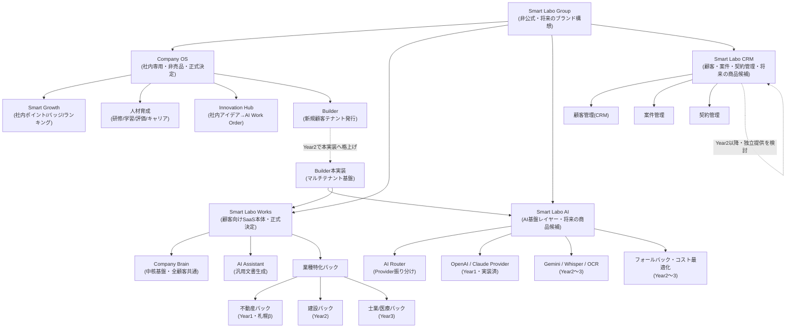

# Smart Labo Works — Product Boundary

> **本書の目的**：現在の `smartlabo-works` には「①株式会社スマートラボ社内専用システム」と「②顧客へ販売するSaaS」が未分離のまま混在している。本書はこの境界を正式に定義し、将来の分社・別プロダクト化・アクセス制御実装の基準とする。
>
> 本書は `PRODUCT_REQUIREMENTS.md`（第9章・第12章の機能一覧、第0章の事実確認）と矛盾しないよう作成した。分類の軸が異なる点に注意：`PRODUCT_REQUIREMENTS.md` は「v1.0に入れるか（Must/Should/Could/Won't）」、本書は「誰のためのものか（社内／顧客共通／不動産専用／将来）」を扱う。

---

## 0. 調査結果と前提

以下を読み、現在存在する全機能を洗い出した。

| 参照ドキュメント | 結果 |
|---|---|
| 現在のコード | `smartlabo-works/app.html`（ナビゲーション30項目以上）、`server.js`（APIエンドポイント7件）、`src/services/ai/**` を実際に読み調査した【事実】 |
| `PROJECT_BIBLE.md` | `smartlabo-works/`直下には存在しない。別リポジトリ`Desktop/SmartLabo/PROJECT_BIBLE/`（`00_Foundation/`〜`60_Editorial_Workflow.md`）を参照した。特に`08_SmartLaboWorks_Concept.md`（「業務領域ごとのAIモジュールの集合体」という設計思想、Company Brain中核基盤の位置づけ）と`10_Future_Roadmap.md`（Company Brain拡張ロードマップ：動画/PDF/Office検索・OCR・議事録検索・音声検索・AI要約・多言語対応）を確認した【事実】 |
| `CURRENT_STATUS.md` | 別リポジトリ側に存在するが、`smartlabo-works/app.html`とは別実装（`WEBSITE/app.html`、Dashboard v0.5）の進捗を記録したものであり、本書の対象コードベースとは一致しない点に注意【事実：前回のPRODUCT_REQUIREMENTS.md 0章で確認済み】 |
| `PRODUCT_REQUIREMENTS.md` | 本リポジトリ内 `smartlabo-works/PRODUCT_REQUIREMENTS.md`（2026-07-10作成）を参照した。第9章の機能個票・一覧表、第12章の画面一覧を本書の棚卸しのベースとして再利用した |

「Smart Labo Group」「Smart Labo AI」「Smart Labo CRM」というプロダクトファミリー構想は、PROJECT_BIBLE内には**まだ存在しない**【事実：検索により確認】。第4章は本書で新たに提案したものであり、下記のCEO決定を受けて内容を確定させた。

---

## 0.1 CEO確認事項への回答(2026-07-10 正式決定)

前回提示した未決定事項に対し、CEOより以下の正式決定があった。**本書・`PRODUCT_REQUIREMENTS.md`・PROJECT_BIBLE（別リポジトリ）はこの前提で統一する。**

| 項目 | 決定内容 |
|---|---|
| 会社名 | 株式会社スマートラボ |
| 販売する製品 | **Smart Labo Works**（顧客向けSaaS） |
| 社内専用システム | **Company OS**（本書第3.1章「①社内専用」に分類した全機能の正式名称） |
| Company OSの販売可否 | **顧客へ販売しない（非売品）** |
| Smart Labo Worksの位置づけ | 顧客向けSaaS。第3.2〜3.3章「②顧客向け共通」「③不動産専用」がこれに該当 |
| 「Smart Labo Group」 | **現時点では正式名称ではない。将来のブランド構想としてのみ記載する**（第4章） |
| 「Smart Labo AI」「Smart Labo CRM」 | **将来の商品候補として整理する。正式製品としては扱わない**（第4章） |

この決定により、第5章で提起していた「Company OSという用語がPROJECT_BIBLE内で２通りの意味に混在している」という未決定事項は**解消**した。PROJECT_BIBLE側（`11_Development_Principles.md` v1.2、`00_Foundation/08_SmartLaboWorks_Concept.md` v3.1）も、Company OSをSmart Labo Works自体の形容として使っていた箇所を修正し、本書の分類と整合させた。

## 0.2 唯一の正式コードベースの確定(2026-07-10 追加決定)

上記のpush作業中、別リポジトリ`SmartLabo`（PROJECT_BIBLE）側に、2026-07-07付で`WEBSITE/app.html`を「Smart Labo Works v1.0 — Company OS完成」とする未マージのコミットが存在することが判明した。マージの結果、**本書が調査対象とした`smartlabo-works`（Node.js版・実際のAI Provider連携あり）と、`WEBSITE/app.html`（GitHub Pages公開・静的デモ）という2つの異なるコードベースが同時に「Smart Labo Works v1.0」を名乗る状態**になっていたため、CEOへ確認した。

CEOの決定は以下のとおり。

| 項目 | 決定内容 |
|---|---|
| Smart Labo Worksの正式コードベース | **`smartlabo-works`（Node.js版）のみ。唯一の正式コードベース** |
| `WEBSITE/app.html`（GitHub Pages版） | **正式製品ではない。今後はデモサイト／マーケティング用プレビューとして扱う** |
| 今後の機能追加 | Smart Labo Worksの機能追加は`smartlabo-works`のみで行う |
| ドキュメント管理 | PROJECT_BIBLE・CURRENT_STATUS・PRODUCT_REQUIREMENTS・PRODUCT_BOUNDARY・BUSINESS_STRATEGYは、いずれも`smartlabo-works`のみを正式版として管理する |
| `WEBSITE`側の古い表記 | Company OS等の古い表記はデモサイトとして整理する（`WEBSITE/app.html`のコード自体には元々「Company OS」という文字列は存在しなかったため、`<title>`・バージョン表示の「Smart Labo Works v1.0」表記をデモである旨に修正した） |

この決定により、本書が第0章〜第6章で行った調査・分類・v1.0機能一覧は**すべてそのまま有効**である（`smartlabo-works`を対象に調査していたため）。PROJECT_BIBLE側は`11_Development_Principles.md`（v1.2→v1.3）・`00_Foundation/08_SmartLaboWorks_Concept.md`（v3.1→v3.2）・`CURRENT_STATUS.md`（v3.1）・`WEBSITE/README.md`（v1.1→v1.2）を更新済み。

---

## 1. 現在存在する全機能の棚卸し

`app.html`のナビゲーション、`server.js`のAPI、`src/services/ai/`の実装を突き合わせ、現時点で「存在する」機能（実装済み・画面のみ・コードのみ未接続を含む）を漏れなく列挙する。

| No. | 機能／画面 | 種別 | 現在の実装状況【事実】 |
|---|---|---|---|
| 1 | ログイン／ログアウト | 認証 | ハードコード単一ID/PW、サーバー側検証なし |
| 2 | ダッシュボード | 画面 | 実装済み（AIブリーフィング、クイックアクション） |
| 3 | Company Brain | 画面＋API | 実装済み（`POST /api/ai/brain`） |
| 4 | AI Work Order | 画面＋API | 実装済み（`POST /api/ai/workorder-gen`） |
| 5 | Company Memory | 画面 | 実装済み（ChatGPT/Claude会話・議事録等のログ保存、`localStorage`） |
| 6 | 会議・会話サマリー | 画面 | 画面実装済み。専用API未接続（`meetingService.js`は`server.js`から未読込） |
| 7 | AI アシスタント | 画面＋API | 実装済み（`POST /api/ai/assistant`、6タイプ） |
| 8 | Innovation Hub | 画面＋API | 実装済み（`POST /api/ai/innovation-review`） |
| 9 | アイデア提案 | 画面 | 実装済み（Innovation Hubのサブ画面） |
| 10 | 商品開発 | 画面 | 実装済み（Innovation Hubのサブ画面） |
| 11 | 顧客管理（CRM） | 画面 | 実装済み。データは`localStorage`のみ |
| 12 | 案件管理 | 画面 | 実装済み。データは`localStorage`のみ |
| 13 | 契約管理 | 画面 | 実装済み。データは`localStorage`のみ |
| 14 | ホームページ管理 | 画面 | 実装済み（詳細内容は未精査、自社サイト管理と推測【推測】） |
| 15 | 営業資料 | 画面 | 実装済み（詳細未精査【推測】） |
| 16 | マーケティング | 画面 | 実装済み（詳細未精査【推測】） |
| 17 | Smart Growth（Dashboard） | 画面 | 実装済み |
| 18 | My Growth | 画面 | 実装済み |
| 19 | Smart Point | 画面 | 実装済み |
| 20 | バッジ | 画面 | 実装済み |
| 21 | ランキング | 画面 | 実装済み |
| 22 | 表彰 | 画面 | 実装済み |
| 23 | 成長履歴 | 画面 | 実装済み |
| 24 | 社長画面（Smart Growth） | 画面 | 実装済み |
| 25 | 社員ダッシュボード | 画面 | 実装済み |
| 26 | 新入社員（オンボーディング） | 画面 | 実装済み |
| 27 | 研修 | 画面 | 実装済み |
| 28 | 学習 | 画面 | 実装済み |
| 29 | 業務マニュアル | 画面 | 実装済み |
| 30 | AI先生（Company Brain連携） | 画面 | 実装済み（Company Brainのローカル検索を流用） |
| 31 | スキル管理 | 画面 | 実装済み |
| 32 | 評価 | 画面 | 実装済み |
| 33 | 改善提案 | 画面 | 実装済み |
| 34 | 資格管理 | 画面 | 実装済み |
| 35 | キャリア | 画面 | 実装済み |
| 36 | Builder（企業インスタンス生成ウィザード） | 画面 | 実装済み。サーバー側の実処理なし、`localStorage`シミュレーション |
| 37 | Company一覧（Builder Dashboard） | 画面 | 実装済み（Builderで生成した企業の一覧表示） |
| 38 | レポート | 画面 | 実装済み |
| 39 | AI設定 | 画面＋API | 実装済み（`GET /api/ai/status`） |
| 40 | AI利用ログ | 画面＋API | 実装済み（`GET /api/ai/logs`、インメモリのみ） |
| 41 | 設定 | 画面 | 実装済み（内容未精査） |
| 42 | AI Router（Provider切替基盤） | 内部基盤 | 実装済み（OpenAI/Claude登録、Gemini/Whisper/OCRは未実装） |
| 43 | AI接続テスト | API | 実装済み（`POST /api/ai/test`） |
| 44 | 不動産INDUSTRY_TEMPLATE（categories/salesFlow/bizFlow/FAQ） | データ | 実装済み（静的データ。AI Routerには未接続） |
| 45 | 他業種テンプレート（建設・製造業・士業・サービス業・小売・医療・その他） | データ | 実装済み（同上、静的データのみ） |
| 46 | 料金プラン（Starter/Pro等） | データ | 実装済み（BuilderのUI表示用データ、正式料金かは未確認） |
| 47 | knowledgeService.js | コード | 実装済みだが`server.js`から未読込（未稼働） |

---

## 2. 4分類の定義

| 分類 | 定義 |
|---|---|
| **①社内専用** | 株式会社スマートラボ自身の経営・人事・製品開発のために使う機能。顧客企業には不要、または見せるべきでない |
| **②顧客向け共通** | 業種を問わず、SaaSとして顧客企業に提供する基盤機能 |
| **③不動産専用** | 不動産会社という最初のターゲット業種に特化した機能・データ |
| **④将来追加** | 現時点では未実装、または構想段階。将来のバージョンで顧客向け・社内向けいずれかに正式配置する |

---

## 3. 機能分類表

各機能について「対象ユーザー／利用頻度／依存関係／顧客へ公開可否／理由」を記載する。関連性の高い画面群はまとめて1行としている（例：Smart Growth群）。

### 3.1 ①社内専用

| 機能 | 対象ユーザー | 利用頻度 | 依存関係 | 顧客へ公開可否 | 理由 |
|---|---|---|---|---|---|
| Innovation Hub／アイデア提案／商品開発 | Smart Labo社員・CEO | 週次〜月次 | `POST /api/ai/innovation-review`、AI Router | **不可** | 自社の新機能・新規事業アイデアを経営判断するための社内プロセス。顧客企業の業務課題とは無関係 |
| AI Work Order生成／Company Memory | Smart Labo社員・CEO | 週次 | `POST /api/ai/workorder-gen`、Innovation Hubの承認結果 | **不可** | 承認されたアイデアをClaude Codeへの作業指示に変換する開発運営ツール。ChatGPT/Claude会話ログという性質上、社内の開発フローに強く紐づく |
| Smart Growth群（Dashboard/My Growth/Point/バッジ/ランキング/表彰/成長履歴/社長画面） | Smart Labo社員・CEO | 毎日〜週次 | localStorage、社員個人データ | **不可** | 社内の人事評価・エンゲージメント施策。顧客企業ごとに評価基準・組織文化が異なり、汎用化できない領域 |
| 人材育成群（社員ダッシュボード/オンボーディング/研修/学習/業務マニュアル/AI先生/スキル管理/評価/改善提案/資格管理/キャリア） | Smart Labo社員（特に新入社員） | 入社時集中、以降は随時 | Company Brain（AI先生が参照）、localStorage | **不可** | 株式会社スマートラボの人材育成制度。将来的に「人材育成SaaS」として独立商品化する余地はあるが、Smart Labo Worksの不動産向けSaaSには不要 |
| ホームページ管理／営業資料／マーケティング | Smart Labo社員（マーケティング担当・CEO） | 週次〜月次 | 自社サイト・自社資料と推測【推測】 | **不可** | 株式会社スマートラボ自身のブランディング・集客活動を管理するツールと推測される。顧客企業向けの機能ではない |
| Builder／Company一覧 | Smart Labo運営者 | 新規契約時のみ | `INDUSTRY_TEMPLATES`、`PLANS`データ | **不可（現状）** | 新規顧客企業のインスタンスを発行する運営者専用ツール。顧客自身が使うものではない。ただし将来的にマルチテナント基盤が本実装されれば、その裏側のエンジンとして「④将来追加」の基盤機能に格上げされる（3.4節参照） |

### 3.2 ②顧客向け共通

| 機能 | 対象ユーザー | 利用頻度 | 依存関係 | 顧客へ公開可否 | 理由 |
|---|---|---|---|---|---|
| ログイン／ログアウト | 顧客企業の全ユーザー | 毎日 | 認証基盤（**現状未実装、要新規実装**） | **可（再実装後）** | SaaSとして提供する以上必須。現状のハードコード認証は顧客提供不可レベル |
| ダッシュボード | 顧客企業の全ユーザー、特に経営者 | 毎日 | Company Brain、CRM、AIログ等の集計 | **可** | 業種を問わず、状況把握の入口として必要 |
| Company Brain | 顧客企業の全ユーザー | 毎日〜頻繁 | AI Router、ナレッジデータ（企業ごとに分離が必要） | **可** | プラットフォーム最大の差別化要素（PROJECT_BIBLE `08_SmartLaboWorks_Concept.md`）。業種を問わない中核基盤 |
| AI アシスタント（汎用文書生成：メール／提案書／補助金申請／広告コピー／議事録） | 顧客企業の営業・事務担当者 | 毎日〜頻繁 | AI Router、`promptManager.js` | **可** | 業種横断で使える汎用文書生成。不動産特化タイプは3.3節へ分離 |
| 会議・会話サマリー | 顧客企業の全ユーザー | 週次 | `meetingService.js`（要API接続） | **可（接続後）** | 業種を問わず必要な議事録機能 |
| 顧客管理（CRM） | 顧客企業の営業・事務担当者 | 毎日 | サーバー永続化（**現状localStorageのみ、要是正**） | **可（是正後）** | 業種を問わない基本機能。現状はデータ分離がなく顧客提供不可レベル |
| 案件管理 | 顧客企業の営業担当者 | 毎日〜週次 | CRMと同様のサーバー永続化課題 | **可（是正後）** | 同上 |
| 契約管理 | 顧客企業の事務担当者 | 週次 | CRM・案件管理と連携 | **可（是正後）** | 同上。ただし電子契約そのものは対象外（PRODUCT_REQUIREMENTS.md第8章） |
| レポート | 顧客企業の経営者・管理者 | 週次〜月次 | AIログ、CRM等の集計 | **可** | 業種を問わない経営可視化機能 |
| AI設定（Provider状態確認） | 顧客企業の管理者 | 月次 | `GET /api/ai/status` | **可（企業スコープ化後）** | 現状は運営者視点の全体設定に近く、顧客企業単位の設定画面へ再設計が必要 |
| AI利用ログ | 顧客企業の管理者 | 週次〜月次 | ログ永続化（**現状インメモリのみ、要是正**） | **可（永続化後、自社分のみ）** | コスト・利用状況の可視化は顧客にも必要。現状は全社共通ログのため企業別分離が必須 |
| 設定 | 顧客企業の管理者 | 随時 | 内容未精査 | **可（内容精査後）** | 一般的な管理機能と推測 |
| AI Router（Provider切替基盤） | システム内部 | 常時（裏側） | OpenAI/Claude Provider | 非公開（**内部基盤のため画面公開の対象外**） | ユーザーが直接触れる機能ではないが、全顧客向け機能の土台であるため②に分類 |

### 3.3 ③不動産専用

| 機能 | 対象ユーザー | 利用頻度 | 依存関係 | 顧客へ公開可否 | 理由 |
|---|---|---|---|---|---|
| 不動産INDUSTRY_TEMPLATE（社内規程カテゴリ・営業フロー・業務フロー・FAQ雛形） | 不動産会社の管理者（初期セットアップ時） | 導入時のみ | Company Brainの初期登録データとして利用 | **可** | 不動産会社の導入初速を上げるための業種特化データ。現状は静的データのみでAI Routerに未接続のため、v1.0で接続が必要 |
| 物件紹介文作成 | 不動産会社の営業担当者 | 毎日〜頻繁 | AI Assistant基盤、AI Router（**未実装、新規プロンプト追加が必要**） | **可（実装後）** | 不動産業務課題#1（PRODUCT_REQUIREMENTS.md第3章）に直結する差別化機能 |
| 査定コメント作成 | 不動産会社の営業担当者 | 週次〜頻繁 | AI Assistant基盤（**未実装**） | **可（実装後）** | 不動産業務課題#6に直結。他業種には転用不可のプロンプト |
| 不動産FAQ初期ナレッジ | 不動産会社の全ユーザー | 導入時登録、以降は参照 | Company Brain | **可** | 「仲介手数料」「重説」等、不動産業界特有の質問に即応するための初期データ |
| 査定書支援（帳票生成含む） | 不動産会社の営業担当者 | 週次 | 査定コメント作成機能（**未実装**） | **可（v1.1以降実装後）** | 不動産業務課題#6の発展形 |
| 成約事例整理テンプレート | 不動産会社の営業担当者・管理者 | 案件成約時 | Company Brain登録フォーマット（**未実装**） | **可（v1.1以降）** | 不動産業務課題#7。ノウハウの組織蓄積という業種特有ニーズ |
| 重説・契約チェックリスト | 不動産会社の事務担当者 | 契約時 | 契約管理機能（**未実装、案**） | **可（実装後）** | 宅建業法対応など不動産特有の契約実務支援 |

### 3.4 ④将来追加

| 機能 | 対象ユーザー（想定） | 利用頻度（想定） | 依存関係 | 顧客へ公開可否 | 理由 |
|---|---|---|---|---|---|
| OCR（画像・PDF文字認識） | 顧客企業の事務担当者 | 週次 | 新規Provider（Gemini等）統合が前提 | **可（実装後）** | PROJECT_BIBLE `10_Future_Roadmap.md`のCompany Brain拡張ロードマップに記載済み。工数大のため段階導入 |
| 音声文字起こし（Whisper） | 顧客企業の全ユーザー | 週次 | 新規Provider統合、録音同意プロセス | **可（実装後）** | 会議・電話記録の自動化。個人情報保護の観点で同意フローの設計が必要 |
| Gemini画像解析 | 顧客企業の営業担当者 | 週次 | Gemini Provider新規実装 | **可（実装後）** | 物件写真の解析等への応用余地あり（要件は未確定）【推測】 |
| マルチテナント基盤（企業管理・ユーザー管理・権限管理・自動プロビジョニング） | Smart Labo運営者（裏側）、顧客企業管理者（表側） | 契約時＋随時 | Builderの本実装化、DB設計 | 非公開（基盤）／画面は顧客管理者に一部公開 | 現状のBuilderはlocalStorageシミュレーションに過ぎない。本番運用にはサーバーサイドでの本実装が必須 |
| Provider自動選択・フォールバック・コスト最適化Router | システム内部 | 常時（裏側） | AI Router拡張 | 非公開（内部基盤） | 現状は全feature実質OpenAI固定。障害耐性・コスト管理の高度化 |
| 他業種テンプレート本実装（建設・士業・医療・製造・小売・サービス業） | 各業種の顧客企業 | 導入時 | 不動産専用機能と同様のパターンを横展開 | **可（実装後）** | `INDUSTRY_TEMPLATES`に静的データは既に存在。不動産での実証後、Phase順に本実装 |
| Company Brain拡張（動画／PDF／Office検索、社内Wiki連携、議事録検索、音声検索、AI要約、多言語対応） | 顧客企業の全ユーザー | 継続利用 | Company Brain基盤の拡張 | **可（実装後）** | PROJECT_BIBLE `10_Future_Roadmap.md`に既存記載のロードマップと一致 |
| MIRAIEコンシェルジュ等の外部連携・埋め込みウィジェット | 顧客企業のWebサイト訪問者（エンドユーザー） | 高頻度（Web経由） | 別プロダクト（MIRAIE）との連携仕様策定 | **可（連携仕様確定後）** | 現状は別プロダクトとして並行開発中【推測：セッション記録より】。将来Smart Labo Worksとの統合可否は未決定 |
| 高度な権限管理・SSO | 顧客企業の管理者・大規模顧客のIT担当 | 導入時＋随時 | マルチテナント基盤 | **可（実装後）** | PRODUCT_REQUIREMENTS.md第8章で「大規模企業向け複雑な権限管理」はv1.0対象外と明記済み。将来の大口顧客獲得時に必要 |

---

## 4. 今後3年間のプロダクト構成案（非公式・将来のブランド構想）

> **【重要】本章はすべて非公式な将来構想であり、正式決定事項ではない。** CEOより「Smart Labo Groupという表現は現時点では正式名称ではない。将来のブランド構想としてのみ記載すること。Smart Labo AI・Smart Labo CRMも将来の商品候補として整理し、正式製品としては扱わないこと」との明示的な指示（2026-07-10）があった。現時点で正式に存在するのは**株式会社スマートラボ**（会社）、**Smart Labo Works**（顧客へ販売するSaaS製品）、**Company OS**（社内専用システム、非売品）の3つのみである（0.1節参照）。

現状の`app.html`単一ファイルに社内・顧客機能が混在している状態から、将来的にどう構造化しうるかの**たたき台（非公式）**として、以下の4プロダクト構成案を記載する。この案自体への合意・不合意はCEO判断待ちであり、第5章の未決定事項にも記載する。

### 4.1 構成の考え方

| プロダクト | ステータス | 位置づけ | 収益 | PROJECT_BIBLEとの関係 |
|---|---|---|---|---|
| **Company OS** | **正式決定**（2026-07-10） | 株式会社スマートラボ自身の経営・人事・製品開発基盤。**顧客へは販売しない非売品** | 収益源ではない（コストセンター） | `11_Development_Principles.md`（v1.2）・`08_SmartLaboWorks_Concept.md`（v3.1）にて、社内専用システムの固有名詞として正式に確定。以前あった「顧客向けダッシュボードの設計思想」としての用法は廃止・修正済み |
| **Smart Labo Works** | **正式決定** | 株式会社スマートラボが**顧客へ販売するSaaS本体**。Company Brain・AI Assistant・業種特化パックで構成 | 主収益源（月額課金） | `08_SmartLaboWorks_Concept.md`の「業務領域ごとのAIモジュールの集合体」という設計思想と一致。業種特化パックという単位はこの思想の具体化 |
| **Smart Labo AI** | **将来の商品候補**（正式製品ではない） | Provider切替・AI Router・将来のOCR/音声等を担う横断基盤レイヤー（構想） | 未定（内部コンポーネントとして無償提供／将来API化の可能性、いずれも未検討） | 現行`src/services/ai/router/`の発展形イメージ。CEOより「将来の商品候補として整理し、正式製品としては扱わない」との明示的な指示あり（2026-07-10） |
| **Smart Labo CRM** | **将来の商品候補**（正式製品ではない） | 顧客・案件・契約管理を独立製品化するイメージ（構想） | 未定 | 現状PROJECT_BIBLEに記載なし。本書での非公式な思考整理。CEOより「将来の商品候補として整理し、正式製品としては扱わない」との明示的な指示あり（2026-07-10） |

### 4.2 年次ロードマップ（案）

| 年次 | 主な取り組み |
|---|---|
| **Year 1** | Company OSと顧客向け機能の分離（本書の分類を実装へ反映）。Smart Labo Worksの不動産パックで札幌β提供。Smart Labo AIはOpenAI/Claudeの2 Providerで運用 |
| **Year 2** | Builderの本実装によるマルチテナント基盤化。建設業パックの追加。Smart Labo AIにGemini/Whisper/OCRを追加。Smart Labo CRMの独立提供を検討開始 |
| **Year 3** | 士業・医療パックの追加。Smart Labo AIの外部API化（MIRAIE等の他プロダクトからの共通利用）。Company OS内の人材育成機能の商品化可否を検討 |

---

## 5. 未決定事項

### 解消済み（2026-07-10 CEO決定により決定済み）

- ~~「Smart Labo Group」「Smart Labo AI」「Smart Labo CRM」というプロダクト名・会社構造は本書での新規提案であり、CEO承認前は非公式な作業名として扱う~~ → **決定：Smart Labo Groupは正式名称ではなく将来のブランド構想としてのみ記載。Smart Labo AI・Smart Labo CRMは将来の商品候補であり正式製品としては扱わない**（0.1節参照）
- ~~「Company OS」という用語は現行PROJECT_BIBLEでは顧客向けダッシュボードの設計原則としても使われており、本書が定義する①社内専用の意味と重複・矛盾する可能性がある~~ → **決定：Company OSは株式会社スマートラボの社内専用システムの固有名詞として正式確定（非売品）。PROJECT_BIBLE側（`11_Development_Principles.md` v1.2、`08_SmartLaboWorks_Concept.md` v3.1）も修正済み**

### 引き続き未決定

- Builder／Company一覧を将来的に顧客向けマルチテナント基盤へ格上げする際、社内専用ツールとしての現行機能（新規契約時の運営者操作）をどう引き継ぐかは未設計
- ホームページ管理／営業資料／マーケティング画面の実際の用途（自社用か顧客提供機能か）は詳細未精査のため、次回調査での確認が必要
- Smart Labo CRM・Smart Labo AIは「将来の商品候補」として位置づけが決まったのみで、実際に商品化するか・いつ着手するかは未検討（本書第4章はあくまで非公式なたたき台）
- 第4章のプロダクト構成案（Company OS／Smart Labo Works／Smart Labo AI／Smart Labo CRMという4分類そのもの）に対するCEOの合意・不合意は未確認

---

## 6. 札幌向けv1.0に含めるべき機能一覧

②顧客向け共通・③不動産専用のうち、`PRODUCT_REQUIREMENTS.md`第7章のMust/Should評価と整合させた、札幌の不動産会社へβ提供する際に含めるべき機能。①社内専用・④将来追加は**明示的に除外**する。

### 含める（v1.0スコープ）

| 機能 | 分類 | 現状ステータス |
|---|---|---|
| ログイン・認証（企業単位で再実装） | ②顧客向け共通 | 要新規実装（最優先） |
| ダッシュボード | ②顧客向け共通 | 実装済み・不動産向けに調整 |
| Company Brain | ②顧客向け共通 | 実装済み・品質改善 |
| AI アシスタント（問い合わせ返信／営業メール／提案書／議事録等） | ②顧客向け共通 | 実装済み |
| 顧客管理（CRM）※サーバー永続化・企業別分離 | ②顧客向け共通 | 要是正（localStorage脱却） |
| AI設定（Provider状態確認） | ②顧客向け共通 | 実装済み・企業スコープ化 |
| AI利用ログ ※永続化 | ②顧客向け共通 | 要是正（DB化） |
| 不動産INDUSTRY_TEMPLATEのCompany Brain初期登録 | ③不動産専用 | 要接続（データは存在） |
| 物件紹介文作成 | ③不動産専用 | 要新規実装 |
| 査定コメント作成 | ③不動産専用 | 要新規実装 |
| 不動産FAQ初期ナレッジ | ③不動産専用 | 要接続（データは存在） |

### 含めない（v1.0スコープ外）

- Smart Growth群、人材育成群、Innovation Hub、AI Work Order／Company Memory、ホームページ管理／営業資料／マーケティング、Builder／Company一覧（すべて①社内専用）
- OCR、音声文字起こし、Gemini画像解析、マルチテナント自動プロビジョニング、他業種テンプレート本実装、Company Brain拡張機能群、MIRAIE連携、高度な権限管理・SSO（すべて④将来追加）
- 案件管理・契約管理（②顧客向け共通だが、CRMのサーバー永続化を優先し、v1.0では後回し。`PRODUCT_REQUIREMENTS.md`ではCould評価）
- 会議・会話サマリー（②顧客向け共通だがAPI未接続のためv1.1へ）

---

## 変更履歴

| バージョン | 日付 | 変更者 | 変更内容 |
|---|---|---|---|
| v1.0 | 2026-07-10 | Claude Code | 初版作成。現行コード・PROJECT_BIBLE・PRODUCT_REQUIREMENTS.mdを調査し、全47機能を①社内専用／②顧客向け共通／③不動産専用／④将来追加へ分類。「Smart Labo Group」プロダクトファミリー構成案（Mermaid図）と札幌向けv1.0機能一覧を新規提案した |
| **v1.1** | 2026-07-10 | Claude Code（CEO指示による） | **CEO確認事項への回答を反映。** 0.1節を新設し、会社名／販売する製品(Smart Labo Works)／社内専用システム(Company OS・非売品)を正式決定として記載。第4章を「非公式・将来のブランド構想」と明記し、「Smart Labo Group」は正式名称ではないこと、「Smart Labo AI」「Smart Labo CRM」は将来の商品候補であり正式製品ではないことを4.1節の表・Mermaid図に反映。第5章の「Company OS用語の重複」「Smart Labo Group等の非公式性」の2件を解消済みへ移動。PROJECT_BIBLE側（`11_Development_Principles.md` v1.2、`08_SmartLaboWorks_Concept.md` v3.1）との整合を確認した |
| **v1.2** | 2026-07-10 | Claude Code（CEO指示による） | **0.2節を新設し、Smart Labo Worksの唯一の正式コードベースを`smartlabo-works`に確定。** `WEBSITE/app.html`（別リポジトリ、GitHub Pages公開版）はSmart Labo Works正式製品ではなく、デモサイト／マーケティング用プレビューへ位置づけ変更されたことを記録。背景として、マージ作業中に`WEBSITE/app.html`側で並行して「Smart Labo Works v1.0」を名乗るコミットが発覚した経緯を記載。本書の調査・分類・v1.0機能一覧（第0〜6章）は`smartlabo-works`を対象としていたため変更なしで有効であることを明記した |
