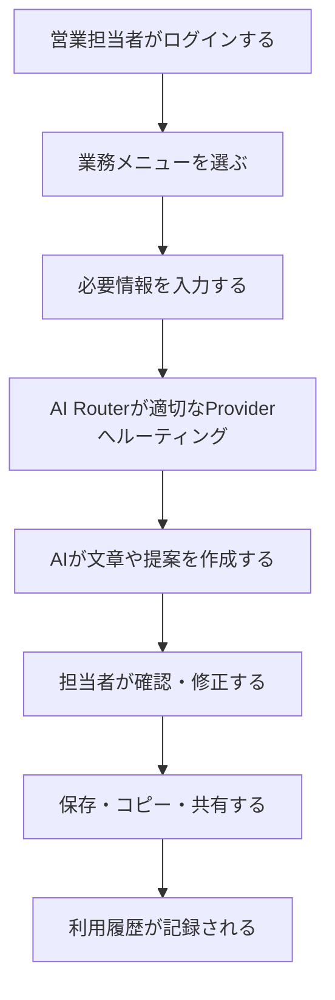
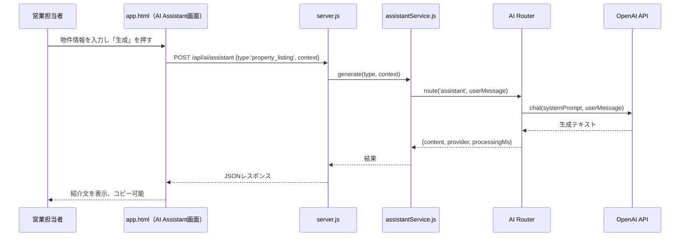
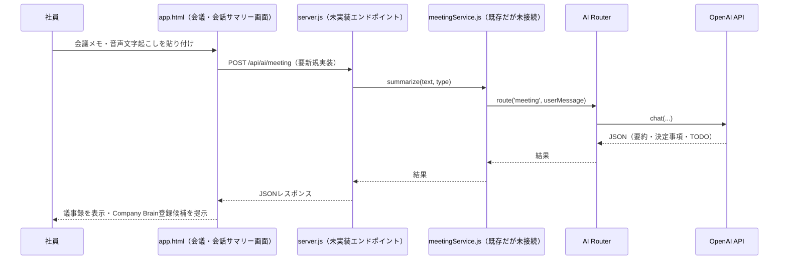
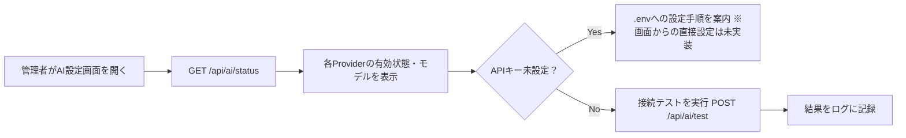
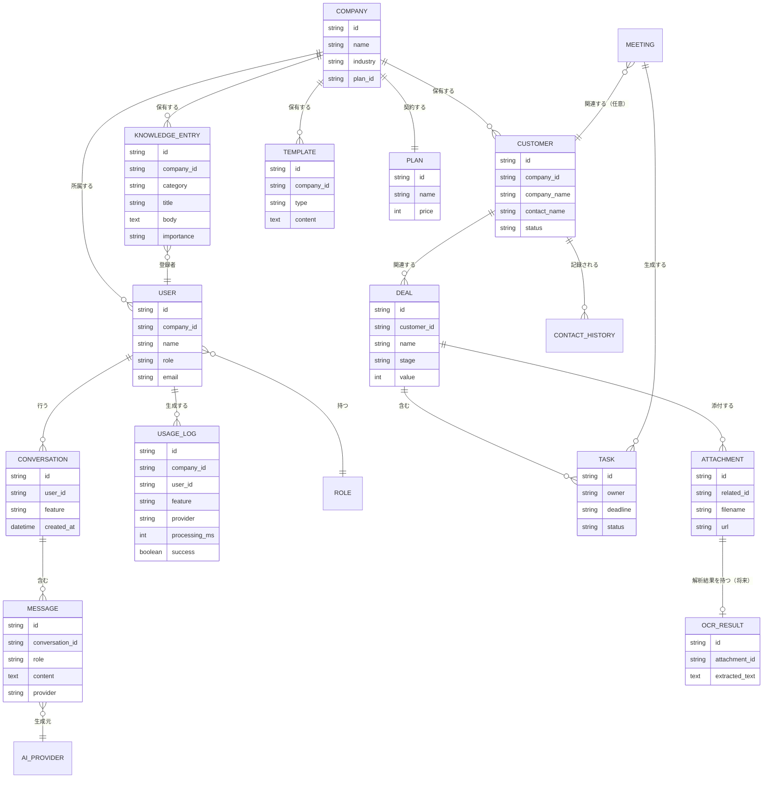

# Smart Labo Works Product Requirements

> **本書の位置づけ**：本書は「何を作り、誰に、どの価値を提供するか」を定義する最上位の製品仕様書です。技術・設計の基準は `CLAUDE.md`、実装の現在地は将来整備する `CURRENT_STATUS.md`、構造改善計画は将来整備する `REFACTOR_PLAN.md` が担います（後述の「0. 調査結果と前提」を参照）。

---

## 0. 調査結果と前提（本書作成にあたっての事実確認）

本書作成にあたり、以下を調査した。

| 参照予定だったファイル | 結果 |
|---|---|
| `smartlabo-works/CLAUDE.md` | **存在する。** 技術方針・禁止事項・API一覧・ファイル構成が記載された開発ガイド。本書はこの内容と矛盾しないよう作成した |
| `PROJECT_BIBLE.md` | `smartlabo-works/` 直下には存在しない。**別リポジトリ** `C:\Users\user\Desktop\SmartLabo\PROJECT_BIBLE\` に会社全体のSingle Source of Truth（`00_Foundation/`〜`60_Editorial_Workflow.md`）として存在することを確認した |
| `CURRENT_STATUS.md` | `smartlabo-works/` 直下には存在しない。別リポジトリ `PROJECT_BIBLE/CURRENT_STATUS.md` に存在するが、これは主に **Homepage（`WEBSITE/index.html`）と Dashboard（`WEBSITE/app.html`、GitHub Pages公開版）の進捗**を記録したものであり、**本リポジトリの `smartlabo-works/app.html`（別実装、v1.1）とは別物**である。両者は同名の「Smart Labo Works / Dashboard」を指しているが、コードベースが異なる２系統である |
| `REFACTOR_PLAN.md` | プロジェクト全体を検索したが**存在しない**（未作成） |
| `README.md` | `smartlabo-works/` 直下には**存在しない**（未作成）。別リポジトリ側に `SmartLaboWorks/README.md`（フォルダ構成の想定のみを記載、実装ファイルなし）が存在する |
| 現在のソースコード | `smartlabo-works/server.js`、`src/config/env.js`、`src/services/ai/**`、`app.html`（323KB・単一ファイルSPA）を読み込んで調査した |
| 既存の画面・API・Provider構成 | `app.html` のナビゲーション・画面遷移関数、`server.js` の `handleAPI()`、AI Router (`router/router.js`) を実際に読み、記載した |

**重要な事実：本書が前提とする「不動産会社向け外部提供SaaS」と、現在 `smartlabo-works/app.html` に実装されている内容には大きなギャップがある。** 現状の `app.html` は「株式会社スマートラボ自身が使う社内Company OS」（ログイン画面の文言は「Company OS — 社内業務管理システム」、認証情報がハードコード）であり、Smart Growth（社内ポイント・バッジ・ランキング・表彰）、キャリア・研修・評価など**社内人事・エンゲージメント機能が全体の半分近くを占める**。不動産特化のAI機能（査定コメント生成・物件紹介文生成・OCR等）は**未実装**である。この乖離は第9章・第22章・第23章・報告部分で詳細に扱う。

本書内では以下の表記ルールを用いる。

- **【事実】** = コードを実際に読んで確認した内容
- **【推測】** = コード・ドキュメントから合理的に推測した内容（未確認）
- **【提案】** = 本書で新たに定義する方針・未決定事項に対する案
- **【未決定】** = 経営判断・CEO確認が必要な事項

---

## 1. ドキュメント情報

| 項目 | 内容 |
|---|---|
| 文書名 | Smart Labo Works Product Requirements |
| バージョン | v1.0 |
| 作成日 | 2026-07-10 |
| 最終更新日 | 2026-07-10 |
| ステータス | ドラフト（CEOレビュー待ち） |
| 対象リリース | v1.0（札幌向けβ提供） |
| 管理責任 | Claude Code（Project Bible編集長 / Lead Software Engineer 兼 Knowledge Manager） |
| 関連ドキュメント | `CLAUDE.md`（技術・設計基準）／ `CURRENT_STATUS.md`（未整備・本書0章参照）／ `REFACTOR_PLAN.md`（未整備）／ `PROJECT_BIBLE/`（別リポジトリ、会社全体のSSOT） |

---

## 2. 製品概要

**Smart Labo Works とは何か【事実＋提案】**
株式会社スマートラボが開発する、中小企業向けの「AI業務支援プラットフォーム」。ブランドメッセージは「会社を動かすAI。」。中小企業に24時間働く「AI事務員」を提供し、社長が本来の仕事（経営判断・意思決定）に集中できる状態を作ることを目的とする。

**どのような企業向けか【事実＋提案】**
最初の主要対象は**不動産会社**（第一号候補：札幌の不動産会社）。将来的に建設業、士業、介護、医療周辺、製造業、小売業等へ横展開する。現在のコード（`INDUSTRY_TEMPLATES`）には不動産・建設・製造業・士業・サービス業・小売・医療・その他の8業種テンプレートが**データとしてのみ**用意されている【事実】。

**どのような業務を支援するか【事実】**
実装済みのAI連携機能は次の4つ：①Company Brain（社内ナレッジへの質問応答）、②AI Assistant（営業メール・提案書・問い合わせ返信・補助金申請文・広告コピー・議事録の文書生成）、③Innovation Hub AIレビュー（社員提案の多角的分析）、④AI Work Order生成（承認済みアイデアのタスク分解）。

**他の一般的なAIチャットとの違い【提案】**
汎用AIチャット（ChatGPT等）との違いは、①社内ナレッジ（Company Brain）に基づいた回答である点、②不動産業務など業種特化のプロンプト・テンプレートを持つ点、③回答だけでなく「次にやること」まで提示し行動につなげる点（`companyBrain` プロンプトの `nextActions`／`canCreate` 設計に明示）【事実】、④将来的に複数AI Providerを自動的に使い分ける「AI Router」を持つ点【事実：Router実装済み、切替ロジックは現状feature固定】。

**最終的に目指す姿【推測（CLAUDE.mdより）】**
「日本で最も使いやすい中小企業向けAI業務支援プラットフォーム」への成長。単発機能ではなく「AIを追加し続けて進化するOS」として、機能追加を前提とした設計を維持する。

---

## 3. 背景と顧客課題

対象：不動産会社。各課題について「現在の業務／問題／影響／Smart Labo Worksによる解決方法／想定効果」を整理する。想定効果の数値は**【推測】**であり、実証前の仮説として扱う。

| # | 課題 | 現在の業務 | 問題 | 影響 | Smart Labo Worksによる解決方法 | 想定効果【推測】 |
|---|---|---|---|---|---|---|
| 1 | 書類作成に時間がかかる | 物件紹介文・メール・提案書を都度手入力 | 定型文でも毎回ゼロから作成 | 営業時間の圧迫 | AI Assistantでの文書生成（提案書・メール等は実装済／物件紹介文・査定コメント特化は未実装） | 文書作成時間30〜50%削減 |
| 2 | 営業担当者ごとに品質が異なる | 個人のスキル・経験に依存した対応 | ベテランと新人で提案の質にばらつき | 機会損失・顧客満足度のばらつき | AIによる文面の標準化・トーン統一 | クレーム率低下、成約率の平準化 |
| 3 | 問い合わせ対応が属人化している | 特定の担当者しか答えられない質問が多い | 担当者不在時に対応が遅れる | 反響対応の機会損失 | Company Brainによる社内ナレッジの即時検索 | 一次回答までの時間短縮 |
| 4 | 会議や電話の記録が残らない | メモを取らない、または個人ノートに散在 | 決定事項・TODOが埋もれる | 認識齟齬・タスク漏れ | AI Assistantの議事録生成タイプ（実装済）／会議専用の要約サービス（`meetingService.js` はコード上存在するがAPI未接続＝未稼働）【事実】 | 議事録作成時間の削減、決定事項の可視化 |
| 5 | 顧客情報・案件情報が分散している | Excel・紙・個人のメモ帳等に分散 | 検索性が低く共有もされない | 引き継ぎ困難、機会損失 | CRM（顧客管理）・案件管理画面（実装済だがブラウザのlocalStorageのみで永続化、サーバー同期なし）【事実】 | 検索時間削減、引き継ぎ品質向上 |
| 6 | 査定書作成に時間がかかる | 手作業で相場調査・コメント作成 | 属人的なノウハウに依存 | 査定スピード・品質のばらつき | 査定コメント生成AI（**未実装**、v1.1以降候補） | 査定書作成時間削減 |
| 7 | 成約事例の収集・整理が大変 | 個人の記憶・紙資料に依存 | 営業ノウハウが組織に蓄積されない | 新人育成コストの増加 | Company Brainへの成約事例登録・検索 | 育成期間短縮 |
| 8 | ホームページからの反響対応が遅れる | 手動でのメール確認・返信 | 初動が遅く機会損失 | 反響の取りこぼし | AI Assistantでの問い合わせ返信生成（実装済） | 初動対応時間短縮 |
| 9 | AIを導入したいが使い方が分からない | 個人でChatGPT等を試すのみ | 組織的な活用に至らない | 投資対効果が見えない | 業種別テンプレート・ダッシュボード・チュートリアル（Builder機能で雛形提示） | 導入初速の向上 |
| 10 | 複数のシステムを使い分ける必要がある | CRM・チャット・議事録ツール等が別々 | 二重入力・情報分断 | 業務効率の低下 | Company OSとしての一元化（ダッシュボード・CRM・AI・ナレッジを1画面に統合） | 業務システムの集約による工数削減 |

---

## 4. ターゲットユーザー

| ユーザー | 役割 | 日常業務 | 困っていること | 必要な機能 | IT習熟度 | 使用端末 | 利用頻度 |
|---|---|---|---|---|---|---|---|
| 不動産会社の経営者 | 経営判断・最終承認 | 資金繰り・採用・営業管理・意思決定 | 現場の状況が見えにくい、時間が足りない | ダッシュボード、KPI可視化、承認機能 | 中（PC苦手な場合あり） | PC・スマホ併用 | 毎日（朝の確認中心） |
| 営業担当者 | 反響対応・接客・案内・契約 | 顧客対応、物件案内、書類作成 | 書類作成に時間がかかる、AI活用の仕方が分からない | AI Assistant、CRM、案件管理 | 低〜中 | スマホ中心、PC併用 | 毎日・頻繁 |
| 事務担当者 | 書類整備・電話対応・データ入力 | 契約書類整理、電話・メール対応 | 定型業務の繰り返し、AIツールを知らない | AI Assistant（メール・書類）、顧客管理 | 低〜中 | PC中心 | 毎日 |
| 管理者（システム担当・情報システム部門的な役割を兼務する社員） | Provider設定・ユーザー管理・利用状況確認 | APIキー設定、利用ログ確認、権限管理 | 設定変更のリスク管理、コスト管理 | Provider設定、AI利用ログ、権限管理 | 中〜高 | PC中心 | 週次〜月次 |
| 将来入社する社員（新入社員・中途） | オンボーディング中の学習 | 業務マニュアル参照、研修受講 | 何を覚えればいいか分からない | 業務マニュアル、AI先生（Company Brain連携）、研修 | 低 | PC・スマホ併用 | 入社後集中的に |
| Smart Labo Works運営者（株式会社スマートラボ自身） | 製品開発・カスタマーサクセス・営業 | 新規契約対応、機能改善、サポート | 顧客ごとの個別要望管理、1人開発の限界 | Builder（企業別インスタンス生成）、利用状況モニタリング | 高 | PC中心 | 毎日 |

---

## 5. ペルソナ

### ペルソナ1：地方の不動産会社社長（山田 誠一・仮名）
- 年齢：52歳／会社規模：社員8名の地場不動産仲介・売買会社（札幌）
- 業務内容：営業陣の管理、金融機関対応、大口案件の最終判断
- 悩み：ベテラン頼みの営業体制で、若手が育たない。ITツールは何度か導入を試みたが定着しなかった
- 利用場面：朝、出社前にスマホでダッシュボードを確認し、その日の重要案件を把握する
- 期待する成果：営業品質の底上げと、自分がいなくても回る仕組み作り

### ペルソナ2：売買営業担当者（佐藤 直樹・仮名）
- 年齢：29歳／入社4年目、中堅の売買仲介担当
- 業務内容：反響対応、物件案内、条件交渉、契約書類の準備
- 悩み：物件紹介文やメール作成に毎回30分以上かかる。定型文をExcelでコピペ管理していて探すのが面倒
- 利用場面：外出先のスマホで顧客対応の合間にメール文面を作成する
- 期待する成果：文書作成時間の削減と、提案の質を落とさずスピードを上げること

### ペルソナ3：営業を支える事務担当者（鈴木 美咲・仮名）
- 年齢：34歳／入社2年目、契約書類・電話対応を担当
- 業務内容：来店対応、電話・メールの一次対応、契約関連書類の整理
- 悩み：営業担当者が不在のときの問い合わせに答えられず、折り返し対応になり顧客を待たせてしまう
- 利用場面：デスクのPCでCompany Brainに質問し、その場で回答して顧客を待たせない
- 期待する成果：属人化した知識に頼らず、その場で正確な一次対応ができるようになること

---

## 6. 製品価値

| 観点 | 内容【提案】 | 将来の測定可能な指標（案） |
|---|---|---|
| 時間削減 | 文書作成・問い合わせ対応の時間を短縮 | 文書作成平均時間（分/件） |
| 人手不足対策 | 少人数でも対応可能な業務量を拡大 | 一人当たり対応件数 |
| 営業品質の標準化 | AIによる文面・提案の品質底上げ | 顧客満足度アンケートスコア |
| 顧客対応速度 | Company Brainによる即時一次回答 | 初回応答までの平均時間 |
| 情報の一元化 | CRM・ナレッジ・AIを1画面に統合 | 利用システム数の削減（定性） |
| 教育コスト削減 | AI先生・マニュアル検索による自走支援 | 新人の独り立ちまでの日数 |
| 売上機会の増加 | 反響対応速度向上による機会損失防止 | 反響→初回接触までの時間 |
| 経営判断の高速化 | ダッシュボードでの状況把握 | 経営者のダッシュボード閲覧頻度 |

---

## 7. v1.0の目標

札幌の不動産会社へ提供する最初のβ版として、**日常業務で実際に使える最小構成**を目指す。以下は現状の実装（第0章参照）を踏まえた評価であり、「実装済み」と「Must/Should=これから作る・整える」は別軸である点に注意。

| 機能候補 | 分類 | 分類理由 |
|---|---|---|
| ログイン・認証 | **Must** | 現状ハードコードされた単一ID/PW【事実】。外部顧客へ提供する以上、企業ごとのアカウントとデータ分離は最低限必須 |
| AIチャット（Company Brain） | **Must** | 中核機能。既にAPI実装済み【事実】。品質を上げてv1.0の柱にする |
| 業務別プロンプト（AI Assistant） | **Must** | 既に6種類実装済み（問い合わせ返信・営業メール・提案書・補助金・広告コピー・議事録）【事実】。不動産特化タイプの追加が必要 |
| 物件紹介文作成 | **Should** | 不動産特化の差別化機能。AI Assistantの型を1つ追加するだけで実現可能（低コスト） |
| 査定コメント作成 | **Should** | 顧客課題#6に対応。プロンプト追加のみで着手可能 |
| メール文作成 | Must（AI Assistantに内包） | 既に`sales_email`/`inquiry_reply`として実装済み |
| 会議要約 | **Could** | `meetingService.js`は実装済みだがAPI未接続【事実】。接続すればコストは低いがv1.0必須ではない |
| OCR | **Won't** | 未実装、Gemini等の新規Provider統合が必要で工数大 |
| 顧客情報管理（CRM） | **Should** | 画面は実装済みだがlocalStorageのみでサーバー永続化・企業間分離がない【事実】。v1.0では最低限のサーバー保存化が必要 |
| 案件管理 | **Could** | CRMと同様の課題を持つため、CRMの土台整備を優先しv1.1へ |
| ホームページAI（Company Brain連携チャットウィジェット） | **Won't**（v1.0） | 別プロダクト（MIRAIEコンシェルジュ等）で先行検証中【推測：memory参照】。Smart Labo Works本体のv1.0スコープ外とする |
| 不動産特化AI（業種テンプレートのAI Router組み込み） | **Should** | `INDUSTRY_TEMPLATES`データは存在【事実】するが、AI Routerや実際のプロンプトには接続されていない。v1.0で最低限「不動産用システムプロンプト」を組み込む |
| 管理者設定（Provider設定・APIキー管理） | **Must** | 現状は`.env`直接編集のみ【事実】。顧客提供する以上、画面からの安全な設定手段が必要（ただしAPIキー入力欄は要注意設計、第16章参照） |
| 利用履歴（AIログ） | **Must** | インメモリログとして実装済み【事実】が、サーバー再起動で消える・永続化なし。最低限の永続化が必要 |
| Smart Growth（社内ポイント・バッジ・ランキング等） | **Won't**（v1.0） | 実装済みだが【事実】、不動産会社への外部提供価値としては優先度が低い社内人事機能。v1.0スコープ外とし、社内利用限定機能として切り離す |
| 研修・キャリア・評価・資格管理 | **Won't**（v1.0） | 同上。人事・タレントマネジメント領域であり、Smart Labo Worksのコア価値（AI業務支援）から外れる。切り離しを提案 |
| Innovation Hub（社内アイデア提案・AIレビュー） | **Could** | 実装済み【事実】で面白い差別化要素だが、顧客の日常業務には直結しない。v1.0では非表示にし、社内運用または将来のアップセル機能として保留 |
| Builder（企業インスタンス生成ウィザード） | **Could** | 現状はlocalStorageのみのシミュレーション【事実】。将来の多店舗・多企業展開時に重要になるが、v1.0の単一顧客導入では過剰機能 |

---

## 8. v1.0で作らないもの

以下はスコープ膨張を防ぐため、v1.0では対応しない。

- 本格的な会計システム
- 電子契約そのもの（重要事項説明書等の電子交付機能は含まない）
- 不動産ポータルサイト（SUUMO等）の完全代替
- 完全自動の価格査定（AIによる査定額の自動算出。あくまで「コメント作成支援」に留める）
- 自動売買判断
- 高度な人事給与管理
- 全業種への同時対応（v1.0は不動産業に集中。テンプレートは残すが他業種向け機能は開発しない）
- ネイティブスマートフォンアプリ（PWA対応で代替。`manifest.json`は既に存在【事実】）
- 大規模企業向け複雑な権限管理（社員数十〜数百名規模のRBAC等）
- Smart Growth・研修・キャリア・評価・資格管理などの社内人事機能（現状実装済みだが、外部顧客向けv1.0からは機能非表示にする）
- Innovation Hub・Builder（社内運用に留め、外部顧客向けUIには露出しない）
- OCR・音声文字起こし（Gemini/Whisper等の新規Provider統合が前提のため、v1.0範囲外）

---

## 9. 機能要求

Must機能（v1.0の中核）は個票形式で、Should/Could/Won'tは一覧表でまとめる。

### 9.1 Must機能（個票）

#### F-001 ログイン・認証
- **対象ユーザー**：全ユーザー
- **目的**：企業ごとにアカウントとデータを分離し、外部顧客へ安全に提供できる状態にする
- **ユーザーストーリー**：私は不動産会社の社員として、自社アカウントでログインし、他社のデータが見えない状態で業務を行いたい
- **入力**：メールアドレスまたはID／パスワード
- **処理**：認証、セッション発行、企業IDの紐付け
- **出力**：ログイン成功時はダッシュボードへ遷移、失敗時はエラーメッセージ
- **前提条件**：ユーザーが管理者によって事前登録されていること
- **エラー時の挙動**：ID/PW不一致時に明確なエラー表示。連続失敗時のロック等は**未決定**
- **完了条件**：企業ごとに異なるアカウントでログインでき、他社データにアクセスできないことを確認
- **優先度**：Must
- **対象バージョン**：v1.0
- **現在の実装状況**：【事実】`app.html`内にハードコードされた単一ID/PW（`ogawa` / `smartlabo2024`）がクライアント側JavaScriptに平文で存在し、認証はフロントエンドのみで完結（サーバー側の検証・セッション管理なし）。本番提供には流用不可
- **関連ファイル**：`app.html`（`#login-screen`、`doLogin()`）

#### F-002 Company Brain（社内ナレッジ検索AI）
- **対象ユーザー**：全社員
- **目的**：社内ナレッジベースに基づいた質問応答で、属人化した知識への依存をなくす
- **ユーザーストーリー**：私は事務担当者として、営業担当者が不在でも、Company Brainに質問して正確な一次回答を顧客に返したい
- **入力**：質問文、ナレッジデータ（クライアントから送信）
- **処理**：キーワードスコアリングでナレッジを抽出→AI Router経由でOpenAIへ問い合わせ→JSON形式で構造化
- **出力**：回答、根拠（evidence）、次のアクション（nextActions）、関連資料、作成可能なもの（canCreate）
- **前提条件**：OpenAI APIキーが`.env`に設定されていること
- **エラー時の挙動**：APIキー未設定・接続失敗時はエラーメッセージを`answer`に格納して返す（実装済）
- **完了条件**：ナレッジ未登録時でも一般回答＋登録促進メッセージが返ること、ナレッジありの場合は根拠付きで回答できること
- **優先度**：Must
- **対象バージョン**：v1.0（実装済・品質改善が必要）
- **現在の実装状況**：【事実】実装済み。`POST /api/ai/brain`。ただしナレッジ検索はキーワード一致のみ（Embedding/ベクター検索は未実装、`companyBrainService.js`内コメントに「将来: Embedding + Vector検索（RAG）対応予定」と明記）
- **関連ファイル**：`server.js`、`src/services/ai/companyBrainService.js`、`src/services/ai/promptManager.js`

#### F-003 AI Assistant（業務文書生成）
- **対象ユーザー**：営業担当者・事務担当者
- **目的**：定型文書の作成時間を削減する
- **ユーザーストーリー**：私は営業担当者として、問い合わせへの返信メールを数分で作成し、対応スピードを上げたい
- **入力**：文書タイプ（`inquiry_reply`/`sales_email`/`proposal`/`subsidy`/`ad_copy`/`minutes`等）、背景・条件テキスト
- **処理**：タイプ別プロンプトを選択しAI Router経由でOpenAIへ問い合わせ
- **出力**：生成された文書テキスト
- **前提条件**：OpenAI APIキー設定済み
- **エラー時の挙動**：エラーメッセージを`content`に格納して返す
- **完了条件**：6タイプすべてで実用的な文書が生成できること
- **優先度**：Must
- **対象バージョン**：v1.0（実装済・不動産特化タイプの追加が必要）
- **現在の実装状況**：【事実】実装済み。`POST /api/ai/assistant`。**不動産特化タイプ（物件紹介文・査定コメント）は未実装**（第7章Should参照）
- **関連ファイル**：`server.js`、`src/services/ai/assistantService.js`、`src/services/ai/promptManager.js`

#### F-004 AI Router / Provider切替基盤
- **対象ユーザー**：システム（内部基盤）、管理者
- **目的**：featureごとに最適なAI Providerへルーティングし、将来のProvider追加を容易にする
- **ユーザーストーリー**：私は運営者として、OpenAIに障害が起きても他のProviderに切り替えて業務を止めたくない（v1.0時点ではフォールバック未実装、将来要件）
- **入力**：feature名、ユーザーメッセージ、オプション
- **処理**：`ROUTE_TABLE`でfeature→Provider名を解決し、該当Providerの`chat()`を呼ぶ
- **出力**：AI応答、Provider名、モデル名、使用量、処理時間
- **前提条件**：対象Providerが`PROVIDERS`に登録済みであること
- **エラー時の挙動**：Provider未登録・APIキー未設定・接続失敗時、`success: false`と`error`メッセージを返す（フォールバックは未実装）
- **完了条件**：featureごとに正しいProviderへルーティングされること
- **優先度**：Must（基盤のため）
- **対象バージョン**：v1.0（実装済・フォールバック機構はv1.1以降）
- **現在の実装状況**：【事実】実装済み。OpenAI・Claudeの2 Providerが登録済み（Geminiはコメントアウトで未実装）。全featureは現状OpenAI固定（`claudePrompt`のみClaude割当だが呼び出し元のUI/APIが存在せず未稼働）
- **関連ファイル**：`src/services/ai/router/router.js`、`src/services/ai/router.js`（後方互換シム）、`src/services/ai/providers/openaiProvider.js`、`src/services/ai/providers/claudeProvider.js`

#### F-005 Provider設定・APIキー管理（管理者画面）
- **対象ユーザー**：管理者
- **目的**：`.env`ファイルを直接編集せずに、安全にAI Providerを設定・確認できるようにする
- **ユーザーストーリー**：私は管理者として、画面からAPIキーの設定状況を確認し、必要な操作（テスト接続等）を行いたい（キー本体の画面入力は要検討、第16章参照）
- **入力**：（現状は表示のみ、将来的に設定変更UIを検討）
- **処理**：`config`から各Providerの有効状態・モデル名を取得
- **出力**：Provider一覧、有効/無効、モデル名
- **前提条件**：管理者権限を持つこと
- **エラー時の挙動**：未設定Providerは「未設定」と明示
- **完了条件**：全Providerの状態が一目で分かること
- **優先度**：Must（最低限の可視化）
- **対象バージョン**：v1.0
- **現在の実装状況**：【事実】`ai-settings`画面が実装済み（`renderAISettings()`）。表示中心で、実際のキー設定はサーバー側`.env`編集が前提。画面からのキー変更機能は未実装
- **関連ファイル**：`app.html`（`renderAISettings()`）、`server.js`（`GET /api/ai/status`）

#### F-006 AI利用ログ
- **対象ユーザー**：管理者
- **目的**：AI利用状況を可視化し、コスト・エラーを把握する
- **ユーザーストーリー**：私は管理者として、AI機能がいつ・どれだけ使われ、エラーが起きていないかを確認したい
- **入力**：なし（自動記録）
- **処理**：各AI API呼び出し時に自動でログを記録（機能名・Provider・処理時間・成否）
- **出力**：ログ一覧（最大200件）
- **前提条件**：なし
- **エラー時の挙動**：エラー内容もログに記録される
- **完了条件**：AI機能利用のたびにログが記録・閲覧できること
- **優先度**：Must
- **対象バージョン**：v1.0（実装済だが永続化が必要）
- **現在の実装状況**：【事実】実装済みだが**インメモリ配列**のみ（`server.js`内`aiLogs`）。サーバー再起動でログが消える。DB化が必要
- **関連ファイル**：`server.js`（`addLog()`、`GET /api/ai/logs`）、`app.html`（`renderAILog()`）

#### F-007 顧客情報管理（CRM）最低限のサーバー保存化
- **対象ユーザー**：営業担当者・事務担当者
- **目的**：顧客情報を個人のメモではなく組織で共有できる状態にする
- **ユーザーストーリー**：私は営業担当者として、他の担当者が入力した顧客情報を自分の端末からも確認したい
- **入力**：会社名・担当者名・役職・業種・連絡先・ステータス・メモ・対応履歴
- **処理**：登録・検索・更新
- **出力**：顧客一覧・詳細
- **前提条件**：ログイン済みであること
- **エラー時の挙動**：必須項目未入力時のバリデーションエラー
- **完了条件**：複数端末・複数ユーザー間でデータが共有されること（v1.0での最低要件）
- **優先度**：Must（サーバー保存化のみ。UI自体はShould扱いの改善に留める）
- **対象バージョン**：v1.0
- **現在の実装状況**：【事実】UI・画面ロジックは実装済み（`renderCRM()`、`initCRM()`）だが、**データはブラウザの`localStorage`のみに保存**され、サーバー同期・複数ユーザー間共有・企業間データ分離が一切ない。外部顧客への提供には致命的な欠落であり、v1.0で最優先の是正対象
- **関連ファイル**：`app.html`（`renderCRM()`、`renderDeals()`、`renderContract()`）

### 9.2 Should / Could / Won't 機能一覧

| 機能ID | 機能名 | 対象ユーザー | 優先度 | 対象バージョン | 現在の実装状況【事実】 | 関連ファイル |
|---|---|---|---|---|---|---|
| F-101 | 物件紹介文作成 | 営業担当者 | Should | v1.0〜v1.1 | 未実装（`assistant`の型追加で対応可能） | `promptManager.js` |
| F-102 | 査定コメント作成 | 営業担当者 | Should | v1.0〜v1.1 | 未実装 | `promptManager.js` |
| F-103 | 顧客対応文作成 | 事務担当者 | Should | v1.0〜v1.1 | `inquiry_reply`として部分実装済み | `assistantService.js` |
| F-104 | 不動産FAQ（Company Brain初期データ） | 全社員 | Should | v1.0 | `INDUSTRY_TEMPLATES.不動産.faq`にサンプルFAQあり（AI Routerには未接続の静的データ） | `app.html` |
| F-105 | 査定書支援（帳票生成含む） | 営業担当者 | Could | v1.1以降 | 未実装 | — |
| F-106 | 成約事例整理 | 営業担当者・管理者 | Could | v1.1以降 | 未実装（Company Brain登録で代替可能） | — |
| F-107 | OCR（書類読取） | 事務担当者 | Won't（v1.0） | v1.2以降 | 未実装。Provider追加が必要 | `router/router.js`（`ocr`は未登録） |
| F-108 | 議事録・会議要約AI | 全社員 | Could | v1.1 | サービス実装済みだがAPI未接続（`meetingService.js`は`server.js`から読み込まれていない） | `meetingService.js` |
| F-109 | ToDo抽出 | 全社員 | Could | v1.1 | `assistant`の`minutes`型に一部含まれるのみ、独立機能はなし | — |
| F-110 | 営業採点 | 管理者 | Won't（v1.0） | 未定 | 未実装 | — |
| F-111 | 社内ルール検索 | 全社員 | Should | v1.0 | Company Brainで代替可能（実質実装済み） | — |
| F-112 | 文書テンプレート管理 | 管理者 | Could | v1.1 | `promptManager.js`がコード内一元管理。画面からの編集機能はなし | `promptManager.js` |
| F-113 | 案件管理 | 営業担当者 | Could | v1.1 | UI実装済み（`renderDeals()`）だがlocalStorageのみ | `app.html` |
| F-114 | 対応履歴・メモ・タスク管理 | 営業担当者 | Could | v1.1 | CRM詳細内に部分実装（`history`配列） | `app.html` |
| F-115 | ユーザー管理 | 管理者 | Must | v1.0 | 未実装（単一ハードコードユーザーのみ） | — |
| F-116 | 企業管理（マルチテナント） | 運営者 | Must（最小限） | v1.0 | 未実装。`Builder`にシミュレーションのみ存在 | `app.html`（`renderBuilder()`） |
| F-117 | 権限管理 | 管理者 | Should | v1.0〜v1.1 | 未実装 | — |
| F-118 | 使用量表示 | 管理者 | Should | v1.0 | `GET /api/ai/status`で一部提供（Provider有効状態のみ、コスト集計は未実装） | `server.js` |
| F-119 | エラー時のフォールバック | システム | Could | v1.1 | 未実装（Provider失敗時は単純にエラー返却） | `router/router.js` |
| F-120 | Innovation Hub（社内アイデア提案AIレビュー） | 社内（運営者） | Won't（v1.0外部提供） | 社内利用継続 | 実装済み・稼働中 | `server.js`（`/api/ai/innovation-review`）、`app.html` |
| F-121 | AI Work Order生成 | 社内（運営者） | Won't（v1.0外部提供） | 社内利用継続 | 実装済み・稼働中 | `server.js`（`/api/ai/workorder-gen`） |
| F-122 | Smart Growth（ポイント・バッジ・ランキング・表彰） | 社内 | Won't（v1.0） | 社内利用継続 | 実装済み | `app.html` |
| F-123 | 研修・キャリア・評価・資格管理 | 社内 | Won't（v1.0） | 社内利用継続 | 実装済み | `app.html` |
| F-124 | Builder（企業インスタンス生成ウィザード） | 運営者 | Could | v1.2以降（マルチテナント本実装時） | UIシミュレーションのみ実装済み（サーバー側の実処理なし） | `app.html`（`renderBuilder()`） |
| F-125 | ホームページ管理・営業資料・マーケティング | 運営者 | Won't（v1.0） | 未定 | UI実装済み（詳細未調査、静的コンテンツと推測）【推測】 | `app.html` |

---

## 10. ユーザーストーリー

主要機能ごとのユーザーストーリー（Must機能中心）。

- 私は不動産会社の営業担当者として、顧客への提案時間を短縮するために、物件情報から紹介文を自動作成したい。
- 私は不動産会社の事務担当者として、営業担当者が不在でも正確に一次対応するために、Company Brainに質問して社内ナレッジを即座に検索したい。
- 私は不動産会社の経営者として、日々の状況を素早く把握するために、朝一番にダッシュボードで重要な案件・数字を確認したい。
- 私は営業担当者として、問い合わせへの返信を素早く送るために、AI Assistantで丁寧な返信メールを自動生成したい。
- 私は管理者として、コストとリスクを管理するために、AI利用ログを確認し、異常な利用や高頻度エラーに気づきたい。
- 私は不動産会社の社員として、他社に自社の顧客情報が漏れないことを確認したうえで、安心してシステムを利用したい。
- 私は営業担当者として、外出先からでも顧客情報を確認するために、複数端末から同じ顧客データにアクセスしたい（現状はlocalStorageのため未達成）。
- 私は運営者（株式会社スマートラボ）として、新規顧客企業を迅速にオンボーディングするために、企業ごとのアカウントとデータ領域を簡単に発行したい。

---

## 11. 主要な利用シナリオ

### 11.1 標準的な業務フロー

### 11.2 物件紹介文の作成（v1.0 Should機能）

### 11.3 顧客へのメール作成

現行の`inquiry_reply`/`sales_email`タイプで実現済み（11.1のフローと同一パターン）。

### 11.4 会議議事録作成（v1.1想定・現状API未接続）

### 11.5 OCRによる書類読取（v1.0範囲外）

未実装のため、シナリオはv1.2以降の設計時に別途定義する【未決定】。

### 11.6 不動産相談への回答

11.1のCompany Brainフローと同一（`INDUSTRY_TEMPLATES.不動産.faq`を初期ナレッジとして登録する運用を想定）。

### 11.7 管理者によるProvider設定

---

## 12. 画面一覧

現状`app.html`には30以上の画面が実装されているが、v1.0で外部顧客に提供するスコープに絞って評価する（○＝v1.0対象、△＝v1.0では非表示/社内限定、✕＝未実装）。

| 画面ID | 画面名 | 対象ユーザー | 目的 | 主な要素 | v1.0対象 |
|---|---|---|---|---|---|
| S-01 | ログイン | 全ユーザー | 認証 | ID/PW入力、ロゴ | ○（要再実装） |
| S-02 | ダッシュボード | 全ユーザー | 状況把握・入口 | AIブリーフィング、クイックアクション、最近の活動 | ○ |
| S-03 | Company Brain | 全ユーザー | ナレッジ検索・質問応答 | 検索バー、AIチャット、カテゴリ一覧 | ○ |
| S-04 | AI アシスタント | 営業・事務 | 文書生成 | タイプ選択、入力欄、生成結果表示 | ○ |
| S-05 | AI Work Order | 運営者 | アイデアのタスク化 | — | △（社内限定） |
| S-06 | Company Memory | 全ユーザー | 会話・決定事項の記録 | — | △（v1.1検討） |
| S-07 | 会議・会話サマリー | 全ユーザー | 議事録作成 | 貼り付け欄、要約結果 | △（API未接続のためv1.0では非公開、v1.1で接続） |
| S-08 | Innovation Hub / アイデア提案 / 商品開発 | 運営者 | 社内提案管理 | — | △（社内限定） |
| S-09 | 顧客管理（CRM） | 営業・事務 | 顧客情報管理 | 一覧・詳細・追加モーダル | ○（要サーバー保存化） |
| S-10 | 案件管理 | 営業 | 案件進捗管理 | — | △（v1.1、サーバー保存化後） |
| S-11 | 契約管理 | 事務 | 契約情報管理 | — | △（v1.1） |
| S-12 | ホームページ管理 / 営業資料 / マーケティング | 運営者 | 自社サイト・資料管理 | — | ✕（v1.0範囲外） |
| S-13 | Smart Growth関連（My Growth/Point/バッジ/ランキング/表彰/履歴/社長画面） | 社内 | 社内エンゲージメント | — | ✕（v1.0では非表示、社内版として別途運用） |
| S-14 | 社員ダッシュボード / オンボーディング / 研修 / 学習 / マニュアル / AI先生 / スキル / 評価 / 改善提案 / 資格 / キャリア | 社内 | 人事・育成 | — | ✕（v1.0では非表示） |
| S-15 | Builder / Company一覧 | 運営者 | 企業インスタンス生成 | — | ✕（v1.0では手動オンボーディングで代替、将来実装） |
| S-16 | レポート | 管理者 | 利用状況・成果レポート | — | △（簡易版のみv1.0検討） |
| S-17 | AI設定 | 管理者 | Provider状態確認 | Provider一覧・有効状態 | ○ |
| S-18 | AI利用ログ | 管理者 | 利用状況・コスト管理 | ログ一覧 | ○（要永続化） |
| S-19 | 設定 | 管理者 | 各種設定 | — | ○（内容は要精査） |
| S-20 | 物件紹介文作成（新規） | 営業 | 不動産特化文書生成 | 物件情報入力欄、生成結果 | ○（新規実装） |
| S-21 | 査定コメント作成（新規） | 営業 | 不動産特化文書生成 | 物件・条件入力欄、生成結果 | ○（新規実装） |
| S-22 | エラー画面 | 全ユーザー | エラー時の案内 | エラーメッセージ、再試行導線 | ○（新規実装、現状専用画面なし） |

---

## 13. 情報設計とナビゲーション

現状のサイドバー構成【事実】は社内向け機能（Smart Growth、研修、Innovation Hub等）を含み、不動産会社の営業担当者にとってはノイズが多い。v1.0では以下の構成へ整理することを提案する【提案】。

- **左サイドバー（v1.0向け再構成案）**
  - ダッシュボード
  - Company Brain
  - AI アシスタント（物件紹介文・査定コメント・メール・提案書等をタブ切替）
  - 顧客管理（CRM）
  - レポート（簡易）
  - 管理者メニュー（Provider設定・AI利用ログ・設定・ユーザー管理）※権限保有者のみ表示
- **上部ヘッダー**：企業名・ログインユーザー名・通知・ログアウト
- **ダッシュボード**：AIモーニングブリーフィング（実装済の考え方を流用）、クイックアクション（物件紹介文作成・メール作成・Company Brain質問など不動産業務に寄せる）
- **業務別カード**：ダッシュボード上に「よく使う機能」をカード表示
- **最近使った機能／お気に入り機能**：v1.1以降で検討【提案】
- **ヘルプ**：初回利用者向けの簡易ガイド（v1.0で最低限のツールチップ程度）
- **エラー通知**：画面右上または該当箇所にインライン表示、AI接続エラー時は再試行ボタンを表示

Smart Growth・研修・Innovation Hub・Builder等の社内機能は、**別URL（例：`/internal/`）または別ビルドとして切り離し**、外部顧客向けナビゲーションには一切表示しないことを提案する【提案・未決定：実装方式はCEO確認要】。

---

## 14. AIの役割分担

### 14.1 現在の実装状況【事実】

| Provider | 実装状況 | 現在の用途 |
|---|---|---|
| OpenAI | 実装済み・稼働中 | Company Brain、AI Assistant全タイプ、Innovation Review、Work Order生成 — 事実上すべてのAI機能がOpenAI固定 |
| Claude | 実装済みだが未稼働 | `ROUTE_TABLE`上は`claudePrompt`featureに割り当てられているが、それを呼び出すAPIエンドポイント・UIが存在しないため実質未使用 |
| Gemini | 未実装 | `PROVIDERS`にコメントアウトで存在するのみ |
| Whisper | 未実装 | 同上 |
| OCR | 未実装 | 同上 |

### 14.2 将来構想（役割分担案）【提案】

| AI | 想定される役割 |
|---|---|
| OpenAI | 汎用チャット、Company Brain、定型文書生成（現状の主力を維持） |
| Claude | 長文の文書分析、仕様書・提案書等の高品質文書生成、複雑な要約・レビュー系タスク |
| Gemini | 画像解析、PDF読取、OCR、将来的なGoogle系サービス連携 |
| Whisper | 会議・電話の音声文字起こし |

**注意**：上記14.2は将来構想であり、現時点でコード上に役割分担ロジックは存在しない（`ROUTE_TABLE`は全featureをほぼOpenAI固定にしているのみ）。

---

## 15. AI Router要求

v1.0〜将来にかけて、AI Routerに以下の機能を段階的に持たせる。

| 要求 | 現状【事実】 | v1.0での対応 | 将来対応 |
|---|---|---|---|
| 入力内容に応じたProvider自動選択 | 未実装（feature固定） | 対応しない | v1.1以降で検討 |
| ユーザーによる手動選択 | 未実装 | 対応しない（管理者向けモデル選択は`getAvailableModels()`で候補が存在するが選択UIは未確認） | v1.1以降 |
| Provider障害時のフォールバック | 未実装 | **Must**：OpenAI障害時に明確なエラーメッセージを返す（フォールバック先Providerへの自動切替は範囲外） | v1.1でClaude等へのフォールバック実装 |
| コストを考慮した選択 | 未実装 | 対応しない | v1.2以降 |
| 処理速度を考慮した選択 | 未実装 | 対応しない | v1.2以降 |
| 機密度を考慮した選択 | 未実装 | 対応しない | v1.2以降（個人情報を含む場合のマスキング等と合わせて検討） |
| 利用履歴 | 実装済み（インメモリ） | **Must**：永続化 | — |
| 使用量計測 | 部分実装（`usage`はレスポンスに含まれるが集計・可視化は未実装） | **Should**：管理画面での集計表示 | v1.1でコスト換算表示 |
| エラーハンドリング | 実装済み（try/catchで`success:false`を返す） | 維持・強化 | — |

---

## 16. 非機能要求

### パフォーマンス
- 初期表示時間：**未計測【未決定】**。`app.html`が323KBの単一ファイルであり、今後機能追加でさらに肥大化する懸念がある。v1.0で計測基準を設定する必要がある
- AI応答開始時間：目標2秒以内（体感でのローディング表示が必要）【提案・要検証】
- API応答時間：Company Brain・AI Assistantともに外部AI API依存のため、5〜15秒程度を許容範囲とする【提案】
- 同時利用者数：**未計測・未検証**。現状`server.js`はNode.js標準の`http`モジュールのみでExpress等未使用、負荷対策なし【事実】

### 可用性
- 稼働率目標：**未決定**（β提供のため厳密なSLAは設定しない想定）
- 障害時の表示：AI接続エラー時は各APIが`success:false`と`error`メッセージを返す設計（実装済）が、ユーザー向けの分かりやすいエラー画面は未整備
- Provider停止時の対応：フォールバックなし。手動でのAI_MODE切替（`.env`の`AI_MODE`）のみ可能【事実】

### セキュリティ
- 認証：**未実装（重大な欠落）**。現状はハードコードされた単一ID/PWがクライアント側コードに平文で存在する【事実】。v1.0で必ず是正する
- 認可：未実装。権限による画面・機能制御なし
- パスワード管理：未実装（ハッシュ化等も存在しない）
- APIキー管理：`.env`ファイルで管理し`.gitignore`対象【事実：`.gitignore`存在確認済み】。ただし画面からのキー入力・変更機能は未実装のため、運用は開発者の手作業に依存
- 通信暗号化：現状`http`（HTTPS未確認）【推測：ローカル開発サーバーのため未対応の可能性が高い】。本番提供時はHTTPS必須
- 入力値検証：APIレベルで必須項目チェックのみ（`title`や`question`の有無等）。XSS/SQLインジェクション対策の作り込みは未確認
- 個人情報保護：CRMに氏名・連絡先等を保存する設計だが、暗号化・アクセス制御は未実装
- ログ管理：AIログは実装済みだが、操作ログ（誰がいつ何をしたか）は未実装
- データ分離：**未実装（重大な欠落）**。企業ごとのデータ分離機構がなく、全データが同一`localStorage`空間に存在する

### 保守性
- モジュール化：AI関連は`src/services/ai/`配下に整理済み【事実】。一方`app.html`はUI・状態管理・業務ロジックが単一ファイルに混在しており、`CLAUDE.md`の禁止事項（「UIとロジックの混在禁止」）と実態が乖離している
- テスト：自動テストは未確認（テストコード・テストフレームワークの導入痕跡なし）
- ドキュメント：`CLAUDE.md`は充実しているが、`README.md`・API仕様書・型定義（JSDocのみ）は限定的
- ログ・エラー追跡：AIログのみ。アプリケーション全体のエラートラッキング（Sentry等）は未導入
- テスト・動作確認なしに「完了」と報告することは`CLAUDE.md`で明示的に禁止されている【事実】。本書のQAプロセスもこれに準拠する

### 操作性
- PC初心者への配慮：日本語UI、アイコン＋テキストのナビゲーション（実装済）
- 日本語中心：全画面日本語【事実】
- 3クリック以内で主要機能へ到達：現状サイドバーの項目数が多く（30項目以上）、v1.0スコープ縮小（第13章）により達成しやすくなる見込み
- エラー内容を分かりやすく表示：現状は簡易的なメッセージのみ。専用エラー画面の新設が必要（S-22）

---

## 17. データ要求

現時点では概念モデルとする。詳細なDB設計は将来の`REFACTOR_PLAN.md`または別途のDB設計書へ分離する。

**重要な事実**：現在のデータ永続化は原則すべて**ブラウザの`localStorage`**（`slw_workspaces_v2`、`slw_innovation_v1`等のキー名で確認）【事実】であり、サーバー側の永続化はAIログ（インメモリのみ、DB化されていない）に限られる。以下のER図は「本来あるべき将来のデータモデル」を示すものであり、**現状の実装状況とは一致しない**。

---

## 18. 権限

v1.0で導入する最低限のロール構成【提案・未決定：詳細はCEO確認要】。

| 権限 | Smart Labo運営管理者 | 顧客企業管理者 | 一般ユーザー | 閲覧限定ユーザー |
|---|---|---|---|---|
| 全企業の横断閲覧 | ○ | ✕ | ✕ | ✕ |
| 自社ユーザーの追加・削除 | ○ | ○ | ✕ | ✕ |
| Provider設定・APIキー管理 | ○ | △（自社分のみ、将来検討） | ✕ | ✕ |
| AI利用ログ閲覧 | ○（全社） | ○（自社のみ） | ✕ | ✕ |
| Company Brain 質問 | ○ | ○ | ○ | ○ |
| Company Brain 編集・登録 | ○ | ○ | △（権限次第） | ✕ |
| AI Assistant 利用 | ○ | ○ | ○ | ✕ |
| 顧客管理（CRM）閲覧 | ○ | ○ | ○ | ○ |
| 顧客管理（CRM）編集 | ○ | ○ | ○ | ✕ |
| 契約・料金プラン変更 | ○ | ✕ | ✕ | ✕ |

現状の実装には権限概念そのものが存在しない（単一ユーザーのみ）ため、上記は**v1.0での新規実装項目**である。

---

## 19. セキュリティ・個人情報

不動産会社が扱う可能性のある情報を分類する。

| 情報 | AIへ送信してよいか | 扱い方針【提案】 |
|---|---|---|
| 氏名 | 条件付きで可 | 文書生成の文脈で必要な場合のみ。Company Brainのナレッジ本文への安易な個人名記載は避ける運用ルールを整備 |
| 住所 | 条件付きで可 | 物件紹介文等の目的で必要な範囲に限定。顧客個人の自宅住所等の機微情報はマスキングを検討 |
| 電話番号 | 条件付きで可 | 返信文生成等の目的に限定 |
| メールアドレス | 条件付きで可 | 同上 |
| 年収 | **要マスキング・要確認** | 与信・審査関連情報のため、AIへの送信は最小限にし、送信前に必ずユーザー確認を挟む運用を検討 |
| 購入希望条件 | 可 | 物件マッチング・提案文脈で通常利用 |
| 所有不動産情報 | 条件付きで可 | 個人が特定される詳細情報（登記情報等）は慎重に扱う |
| 契約関連情報 | **要マスキング・要確認** | 契約金額・特約等の機微情報は目的外送信を避ける |
| 会議音声 | 現状未実装 | 将来Whisper連携時は録音の同意取得プロセスが必須 |
| 顧客との会話 | 条件付きで可 | 議事録・要約目的では利用するが、機微情報は要約前にマスキングする運用を推奨 |

**現状のコード実装にはマスキング機構が存在しない**【事実】。プロンプト（`companyBrainService.js`）はナレッジ本文をそのままAIへ送信する設計であり、v1.0で最低限の注意喚起（入力時の警告表示等）を検討する【提案・未決定】。

---

## 20. KPI

v1.0導入後に測定する候補（現状KPI計測機構は未実装のため、すべて**将来導入する指標の案**）。

- 週次アクティブユーザー（WAU）
- AI利用回数（機能別：Company Brain／AI Assistant）
- 業務別利用回数（メール作成／物件紹介文／査定コメント等）
- 文書作成時間の削減（導入前後比較、ヒアリングベース）
- 議事録作成時間の削減（v1.1機能公開後）
- OCR利用件数（v1.2以降）
- AI回答の採用率（生成結果をそのまま使った割合）
- 再生成率（AIの回答を再生成した割合、品質指標）
- エラー率（AI呼び出し失敗率、`aiLogs`の`success:false`比率から算出可能）
- 顧客満足度（定性アンケート）
- 継続利用率（β期間後の契約継続）

---

## 21. 受入条件

札幌の不動産会社へβ版として提供可能と判断する条件。

- [ ] 企業ごとのアカウントでログインできる（現状未達：ハードコード認証のみ）
- [ ] 企業ごとにデータが分離される（現状未達：`localStorage`のみでサーバー側分離なし）
- [ ] Company Brain・AI Assistantが正常に動作する（現状達成：実装済み・稼働確認済み）
- [ ] APIキーが画面へ露出しない（現状は`.env`管理で露出はしていないが、フロントエンドのハードコード認証情報は露出している点に注意）
- [ ] エラー時に適切な案内が表示される（現状未達：専用エラー画面なし）
- [ ] 基本操作マニュアルがある（現状未達：未作成）
- [ ] 重大な既知バグがない（現状未確認：QAプロセス未実施）
- [ ] バックアップ方法がある（現状未達：DB自体が存在しないため対象外、DB導入後に整備）
- [ ] 問い合わせ窓口が決まっている（**未決定**：CEO確認要）

---

## 22. リリース計画

現在の実装状況（第0章・第9章）に合わせて調整した現実的な計画。**バージョン番号は本書独自の管理であり、`CLAUDE.md`記載の`app.html`内バージョン表記（v1.1）や、別リポジトリのPROJECT_BIBLE側`CURRENT_STATUS.md`が管理する「Smart Labo Works Version 0.5」（別実装のDashboardを指す）とは異なる軸である**点に注意。本書のバージョンは「不動産会社向け外部提供版としての到達度」を表す。

| バージョン | 内容 |
|---|---|
| v0.2 | 現在の構造改善・リファクタリング：`app.html`の肥大化への対処方針決定、`REFACTOR_PLAN.md`の作成 |
| v0.3 | 認証・企業管理・基本セキュリティ：サーバーサイド認証、企業単位のデータ分離設計、パスワード管理 |
| v0.4 | AI Router・Provider切替：フォールバック機構、使用量集計の実装 |
| v0.5 | 不動産業務テンプレート：物件紹介文・査定コメント生成タイプの追加、`INDUSTRY_TEMPLATES.不動産`のAI Router組み込み |
| v0.6 | OCR・議事録：`meetingService.js`のAPI接続、OCR Providerの追加検討 |
| v0.7 | 顧客・案件管理：CRM・案件管理のサーバー永続化 |
| v0.8 | 札幌向け実証版：不動産会社1社分のデータを用いた実地検証、フィードバック収集 |
| v0.9 | フィードバック反映：実証で見つかった課題の修正 |
| v1.0 | 正式β提供：受入条件（第21章）をすべて満たした状態で提供開始 |

---

## 23. リスク

| リスク | 発生可能性 | 影響度 | 対応策 | 検知方法 |
|---|---|---|---|---|
| 開発範囲の拡大（社内人事機能等が肥大化し続ける） | 高（既に発生中、第0章参照） | 高 | v1.0スコープを本書で明文化し、社内機能を切り離す | 定期的な本書との照合レビュー |
| 個人情報漏えい（データ分離なし） | 高（現状データ分離が皆無） | 極めて高 | v1.0でサーバーサイド認証・企業別データ分離を必須実装 | セキュリティレビュー、ペネトレーションテスト |
| AIの誤回答 | 中 | 中 | Company Brainの「evidence」提示、ナレッジ未登録時の明示的表示（実装済の設計を維持） | 再生成率・ユーザーフィードバックの計測 |
| Provider障害 | 中 | 中 | フォールバック機構の実装（v1.1） | AIログのエラー率監視 |
| API費用増加 | 中 | 中 | 使用量計測・上限アラートの実装（v1.0以降で検討） | AI利用ログの定期確認 |
| UIの複雑化（30以上の画面が単一ファイルに集中） | 高（既に発生中） | 中 | v1.0スコープ縮小、将来的なコード分割（`REFACTOR_PLAN.md`で計画） | コードレビュー、`app.html`ファイルサイズの継続監視 |
| 顧客ごとの個別要望 | 高（不動産業界特有のカスタム要望が想定される） | 中 | Must/Should/Could/Won'tの分類を都度更新し、安易な個別対応を避ける | 本書の更新ルール（第25章）運用 |
| データ移行（localStorage→サーバーDB） | 高（現状の設計を前提とすると必須の移行作業） | 高 | 早期にDB設計・移行方針を決定（`REFACTOR_PLAN.md`） | — |
| サポート負荷 | 中 | 中 | 問い合わせ窓口・FAQ整備（第21章で未決定事項として明記） | 問い合わせ件数のモニタリング |
| 1人開発による属人化 | 高（現状の開発体制） | 高 | ドキュメント整備（本書・CLAUDE.md・将来のREFACTOR_PLAN.md）の継続、コードコメント・型定義の充実 | ドキュメントカバレッジの定期確認 |

---

## 24. 未決定事項

以下は現時点で決まっていない。**隠さず一覧化する。**

- 本番インフラ（現状はNode.js標準httpモジュールのみのローカルサーバー。ホスティング先・スケーリング方針は未定）
- データベース（現状は`localStorage`＋インメモリログのみ。RDB/NoSQLの選定は未定）
- 認証方式（自前実装／Auth0等のID基盤利用／その他、いずれも未定）
- 顧客ごとの環境分離方式（同一DB内でのテナントID分離／物理分離、いずれも未定）
- 正式料金（`app.html`内に`PLANS`データ（Starter ¥9,800/月、Pro ¥29,800/月等）が存在するが【事実】、これがBuilderのデモ用データなのか正式な料金として確定しているのかは**未確認**）
- 利用規約（本リポジトリ内には未確認。別プロジェクト「不動産賃貸借契約書」等の文書は存在するが、Smart Labo Works自体の利用規約は別途要確認）
- プライバシーポリシー（同上、未確認）
- AI入力データの保存期間
- サポート体制（問い合わせ窓口、対応時間等）
- SLA
- Smart Growth等の社内機能を切り離す実装方式（別ビルド／別ルート／フラグ制御のいずれか）
- Builder（企業インスタンス生成）を将来どこまで自動化するか、それとも当面は手動オンボーディングで運用するか
- Claude Providerを実際にどのfeatureへ本格導入するか（現状は接続先が存在しないまま実装のみ完了している）

---

## 25. 更新ルール

以下の場合に`PRODUCT_REQUIREMENTS.md`を更新する。

- v1.0の対象機能変更
- 顧客要望の採用
- 画面追加・削除
- 権限変更
- KPI変更
- リリース計画変更
- PROJECT_BIBLE変更（別リポジトリ側の方針変更が本書に影響する場合）
- 新しい業種への展開決定

変更履歴は本ファイル末尾に追記する。

---

## 変更履歴

| バージョン | 日付 | 変更者 | 変更内容 |
|---|---|---|---|
| v1.0 | 2026-07-10 | Claude Code | 初版作成。CLAUDE.md・現行`app.html`／`server.js`／AI Router実装を調査した上で、不動産会社向け外部提供SaaSとしてのv1.0スコープを定義。現状の社内Company OS実装（Smart Growth・研修・Innovation Hub等）とのギャップを明記し、v1.0では非表示・社内限定とする方針を提案した |
